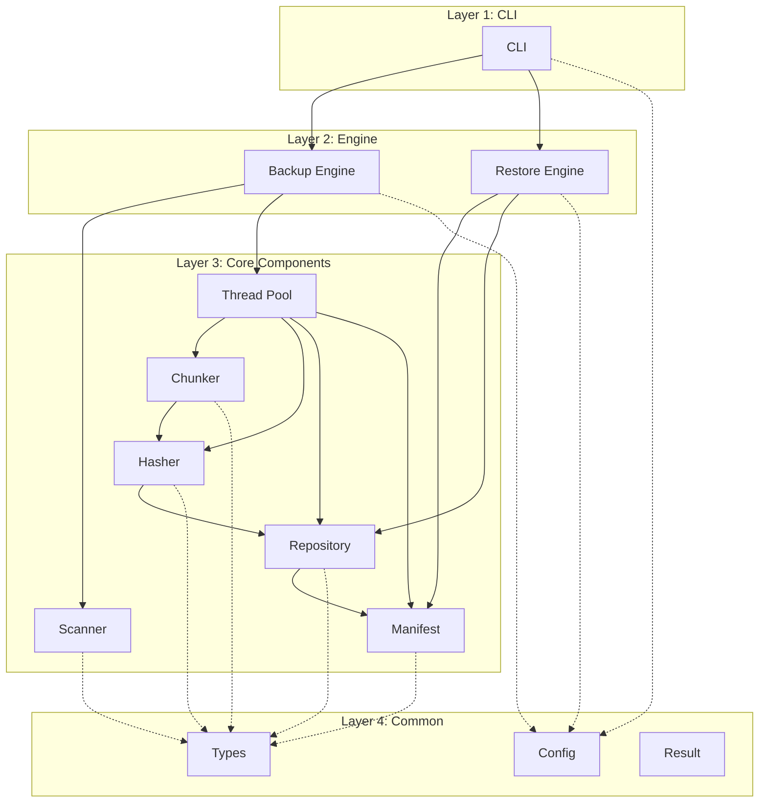
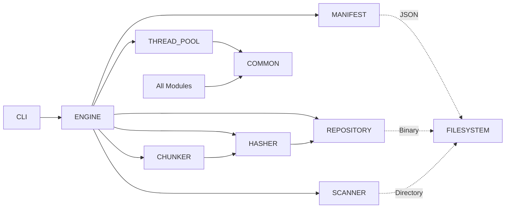
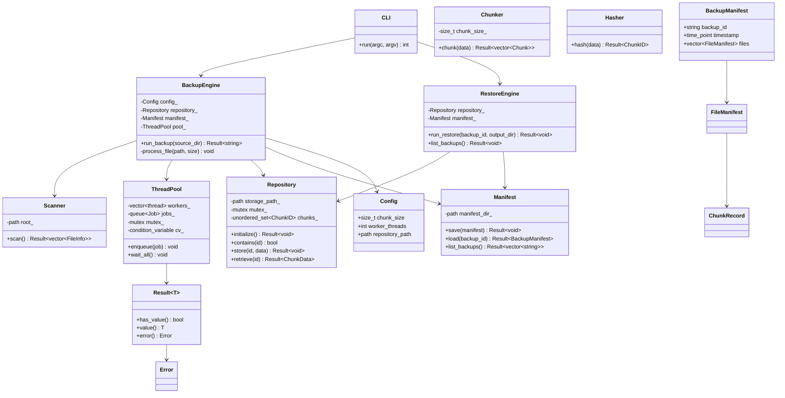
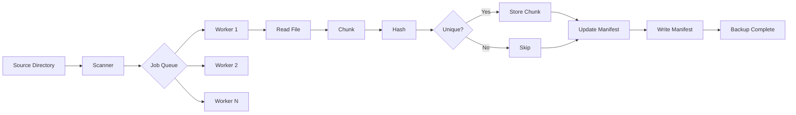
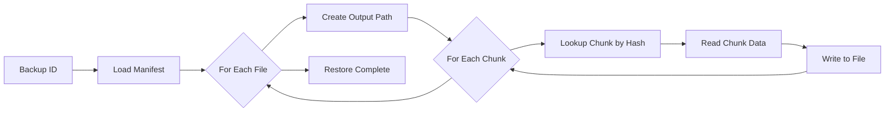

# Architecture

## Overview

BackupCore follows a clean layered architecture. Each layer has a single responsibility and communicates with adjacent layers through well-defined interfaces.



## Module Dependencies



## Class Diagram



## Directory Structure

```text
src/
├── cli/            # Command-line interface
│   ├── cli.h
│   └── cli.cpp
├── engine/         # Orchestration layer
│   ├── backup_engine.h/cpp
│   └── restore_engine.h/cpp
├── scanner/        # Filesystem traversal
│   ├── scanner.h
│   └── scanner.cpp
├── chunker/        # Fixed-size chunk splitting
│   ├── chunker.h
│   └── chunker.cpp
├── hasher/         # SHA256 content hashing
│   ├── hasher.h
│   └── hasher.cpp
├── repository/     # Chunk storage and dedup
│   ├── repository.h
│   └── repository.cpp
├── manifest/       # Backup metadata
│   ├── manifest.h
│   └── manifest.cpp
├── thread_pool/    # Parallel job execution
│   ├── thread_pool.h
│   └── thread_pool.cpp
└── common/         # Shared types and utilities
    ├── types.h
    ├── config.h/cpp
    └── result.h
```

## Data Flow

### Backup



### Restore


