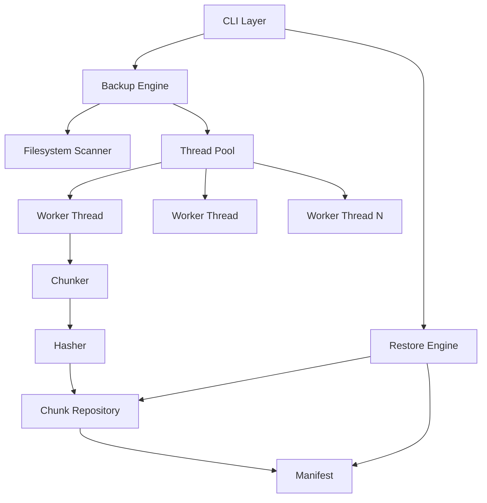
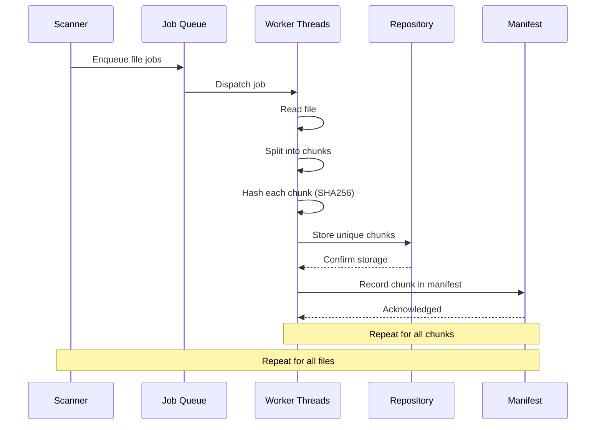
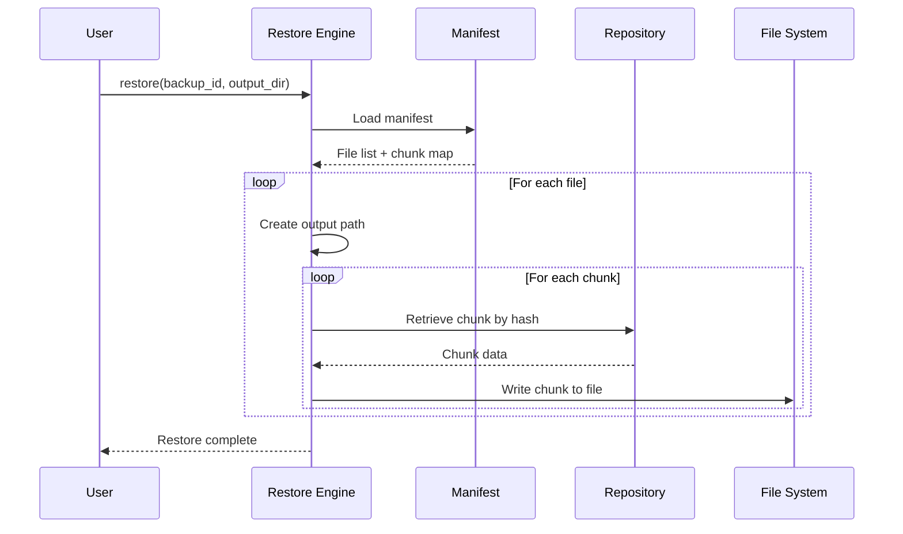
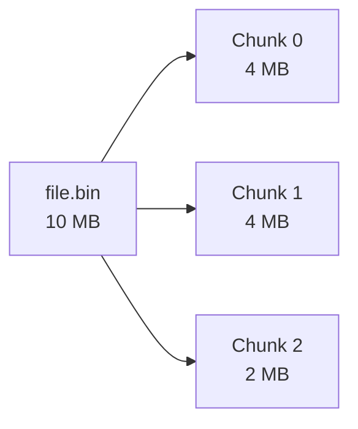
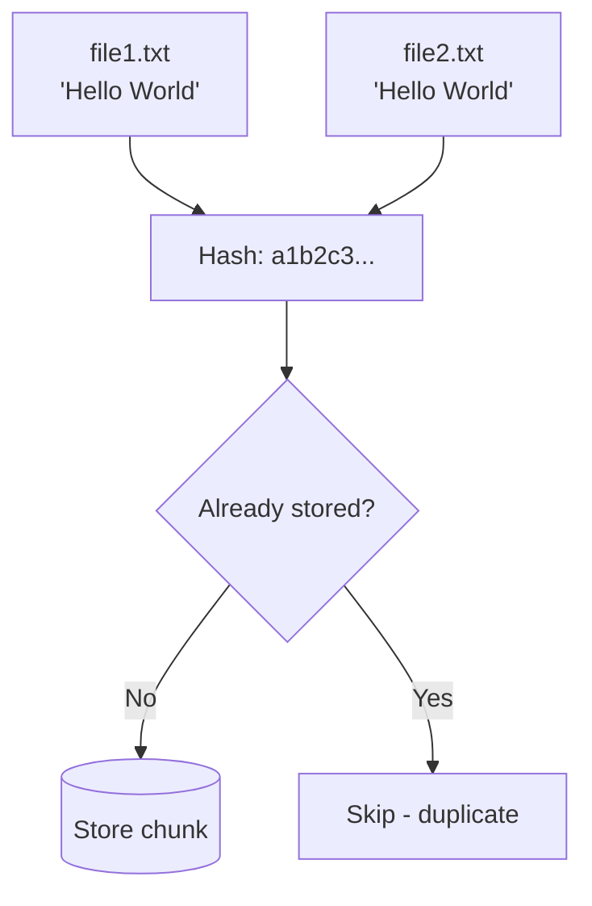

# BackupCore

**How does a backup engine work internally?**

BackupCore is an educational open-source project that demonstrates the internal architecture of a backup engine. Built with modern C++20, it implements the core concepts found in enterprise backup software — filesystem traversal, chunking, content hashing, deduplication, thread-pool-based parallelism, and full restore — without the complexity of production features like cloud storage, encryption, or scheduling.

This repository is designed for software engineers who want to understand how backup software works at the system level.

---

## Features

- **Recursive filesystem scanner** — walks directory trees and discovers files
- **Fixed-size chunking** — splits files into configurable chunks (default 4 MB)
- **SHA256 hashing** — each chunk generates a unique content hash
- **Content deduplication** — only unique chunks are stored; duplicates are skipped
- **Chunk repository** — chunks stored by hash on local disk
- **Backup manifests** — JSON-based metadata recording every backup
- **Full restore** — reads manifest, fetches chunks, reassembles files
- **Thread pool** — configurable worker threads for parallel processing
- **Configuration** — simple `config.json` for runtime settings

---

## Quick Start

### Prerequisites

- **CMake** 3.20+
- **C++20** compiler (Clang 14+, GCC 11+, MSVC 2022+)
- **OpenSSL** (libcrypto for SHA256)
- **Google Test** (for building tests)

### Build

```bash
git clone https://github.com/yourusername/backupcore.git
cd backupcore
cmake -B build
cmake --build build
```

### Run a Backup

```bash
./build/src/backupcore backup /path/to/important/files
```

### Restore

```bash
./build/src/backupcore restore backup_20260101_120000_000 /path/to/restore/destination
```

### List Available Backups

```bash
./build/src/backupcore list
```

---

## Example

```text
$ ./build/src/backupcore backup ~/Documents
Backup: backup_20260717_194136_876
Files: 42
Total size: 15632384 bytes
  Progress: 42/42 files  (unique chunks: 7)
Backup complete.
  Files backed up: 42
  Unique chunks: 7
  Total stored: 4194304 bytes
  Dedup ratio: 3.73x
Backup ID: backup_20260717_194136_876
```

```text
$ ./build/src/backupcore restore backup_20260717_194136_876 /tmp/restored
Restoring: backup_20260717_194136_876
Files: 42
  Restored: "report.pdf"
  Restored: "notes.txt"
  ...
Restore complete.
  Files restored: 42/42
  Bytes restored: 15632384
```

---

## Architecture



### Backup Pipeline



### Restore Pipeline



---

## How It Works

### Chunking

Files are split into fixed-size chunks. The default chunk size is 4 MB, configurable in `config.json`.



Each chunk is processed independently by worker threads.

### Hashing

Every chunk is hashed using SHA256:

```text
Chunk Data → SHA256 → 2cf24dba5fb0a30e26e83b2ac5b9e29e1b161e5c1fa7425e73043362938b9824
```

The hash serves as the chunk's unique identifier.

### Deduplication



When two files contain identical data, they produce identical hashes. Only the first occurrence is stored. All subsequent occurrences reference the existing chunk.

### Manifest

Each backup generates a JSON manifest containing:

```json
{
    "backup_id": "backup_20260717_194136_876",
    "timestamp": 1761262896,
    "files": [
        {
            "path": "Documents/report.pdf",
            "original_size": 2048000,
            "chunks": [
                { "id": "a1b2c3...", "size": 4194304, "offset": 0 },
                { "id": "d4e5f6...", "size": 2048000, "offset": 4194304 }
            ]
        }
    ]
}
```

The manifest is the single source of truth for restore operations.

### Repository

```text
repository/
├── chunks/
│   ├── a1b2c3d4e5f6...6789.chunk
│   ├── b2c3d4e5f6a7...7890.chunk
│   └── ...
└── manifests/
    ├── backup_20260717_194136_876.json
    └── ...
```

Chunks are stored as individual files named by their SHA256 hash. The manifest directory contains one JSON file per backup.

---

## Configuration

```json
{
    "chunk_size": 4194304,
    "worker_threads": 4,
    "repository_path": "./repository"
}
```

| Field | Default | Description |
|-------|---------|-------------|
| `chunk_size` | 4194304 (4 MB) | Size of each data chunk in bytes |
| `worker_threads` | 4 | Number of parallel worker threads |
| `repository_path` | `"./repository"` | Directory for chunk and manifest storage |

---

## Project Structure

```text
BackupCore/
├── CMakeLists.txt
├── config.json
├── src/
│   ├── cli/            Command-line interface
│   ├── engine/         Backup and restore engines
│   ├── scanner/        Filesystem scanner
│   ├── chunker/        Fixed-size chunking
│   ├── hasher/         SHA256 hashing
│   ├── repository/     Chunk storage and retrieval
│   ├── manifest/       Backup metadata
│   ├── thread_pool/    Parallel job execution
│   └── common/         Shared types and utilities
├── tests/              Unit and integration tests
├── benchmarks/         Performance benchmarks
└── docs/               Architecture documentation
```

---

## Documentation

| Document | Description |
|----------|-------------|
| [ARCHITECTURE.md](ARCHITECTURE.md) | System architecture and module design |
| [DESIGN.md](DESIGN.md) | Design decisions and trade-offs |
| [THREADING.md](THREADING.md) | Threading model and concurrency |
| [REPOSITORY.md](REPOSITORY.md) | Repository storage internals |
| [RESTORE.md](RESTORE.md) | Restore process in detail |
| [ROADMAP.md](ROADMAP.md) | Future work and enhancements |
| [CONTRIBUTING.md](CONTRIBUTING.md) | How to contribute |
| [BENCHMARKS.md](BENCHMARKS.md) | Performance measurements |

---

## Future Work

BackupCore intentionally omits many production features. See [ROADMAP.md](ROADMAP.md) for details, but the most notable omissions are:

- No cloud or network backup
- No incremental or differential backup
- No compression or encryption
- No scheduling or automation
- No UI or web interface

---

## License

MIT License. See [LICENSE](LICENSE) for details.
