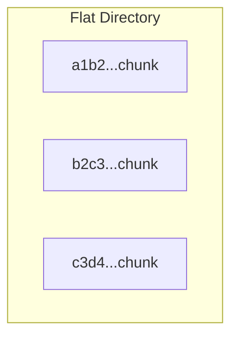
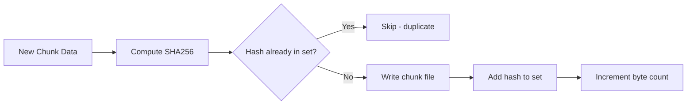

# Repository Design

## Overview

The repository is where backup data lives on disk. It stores two things:

1. **Chunks** — deduplicated file data, each identified by its SHA256 hash
2. **Manifests** — metadata describing what was backed up and when

```text
repository/
├── chunks/
│   ├── a1b2c3d4e5f6...6789.chunk
│   ├── b2c3d4e5f6a7...7890.chunk
│   └── ...
└── manifests/
    ├── backup_20260717_194136_876.json
    └── ...
```

## Chunk Storage

### File Naming

Each chunk is stored as a file named by its SHA256 hash:

```
<64-character-hex-digest>.chunk
```

Example:
```
2cf24dba5fb0a30e26e83b2ac5b9e29e1b161e5c1fa7425e73043362938b9824.chunk
```

This naming scheme provides:
- **Content-addressed storage** — the name IS the content
- **Automatic deduplication** — writing the same data produces the same name
- **Integrity verification** — rename the file to check corruption

### Storage Layout



Chunks are stored in a single flat directory. For production use, sharding by prefix (e.g., `a1/`, `a1/b2/`) would prevent filesystem slowdowns with millions of files.

## Deduplication



### Implementation

```cpp
Result<void> Repository::store(const ChunkID& id, const ChunkData& data) {
    std::lock_guard<std::mutex> lock(mutex_);

    // Thread-safe duplicate check
    if (chunks_.contains(id)) {
        return Result<void>(true);  // Already stored
    }

    // Write to disk
    auto path = chunk_path(id);
    std::ofstream file(path, std::ios::binary);
    file.write(reinterpret_cast<const char*>(data.data()),
               static_cast<std::streamsize>(data.size()));

    // Update in-memory state
    chunks_.insert(id);
    total_bytes_ += data.size();

    return Result<void>(true);
}
```

The in-memory `unordered_set` provides O(1) duplicate checks. The mutex ensures thread safety when multiple workers discover the same content simultaneously.

## Deduplication Ratio

The dedup ratio measures storage efficiency:

```
Dedup Ratio = Total Original Size / Total Stored Bytes
```

| Ratio | Meaning |
|-------|---------|
| 1.0x | No duplicates (all data unique) |
| 2.0x | Half the data was duplicate |
| 5.0x | 80% of data was duplicate |
| 10.0x+ | Highly repetitive data (logs, VMs) |

Typical workloads show 2-5x for documents, 5-20x for VM images.

## Manifest Storage

Manifests are JSON files stored in `repository/manifests/`:

```json
{
    "backup_id": "backup_20260717_194136_876",
    "timestamp": 1761262896,
    "timestamp_iso": "2026-07-17T19:41:36Z",
    "files": [
        {
            "path": "Documents/report.pdf",
            "original_size": 2048000,
            "chunks": [
                { "id": "a1b2c3...", "size": 4194304, "offset": 0 },
                { "id": "d4e5f6...", "size": 2048000, "offset": 4194304 }
            ]
        }
    ]
}
```

Each manifest contains:
- **backup_id** — unique identifier (timestamp-based)
- **timestamp** — when the backup was created
- **files** — array of backed-up files
  - **path** — relative path from source directory
  - **original_size** — original file size (before dedup)
  - **chunks** — ordered array of chunks comprising the file
    - **id** — SHA256 hash (matches a .chunk file)
    - **size** — chunk data size
    - **offset** — byte offset in the original file

## Repository Class

```cpp
class Repository {
public:
    explicit Repository(std::filesystem::path storage_path);
    Result<void> initialize();
    bool contains(const ChunkID& id) const;
    Result<void> store(const ChunkID& id, const ChunkData& data);
    Result<ChunkData> retrieve(const ChunkID& id) const;
    size_t unique_chunk_count() const;
    uint64_t total_stored_bytes() const;
};
```

### Initialization

`initialize()` creates the storage directory structure if it doesn't exist, then scans for existing chunks to rebuild the in-memory dedup set:

```cpp
for (const auto& entry : std::filesystem::directory_iterator(chunks_path_)) {
    if (entry.is_regular_file()) {
        ChunkID id = entry.path().stem().string();  // Remove ".chunk" extension
        chunks_.insert(id);
        total_bytes_ += entry.file_size();
    }
}
```

This allows the repository to survive process restarts and maintain accurate dedup tracking.
