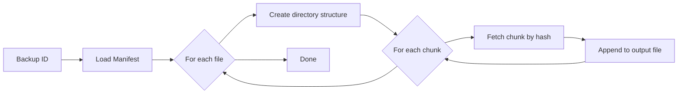
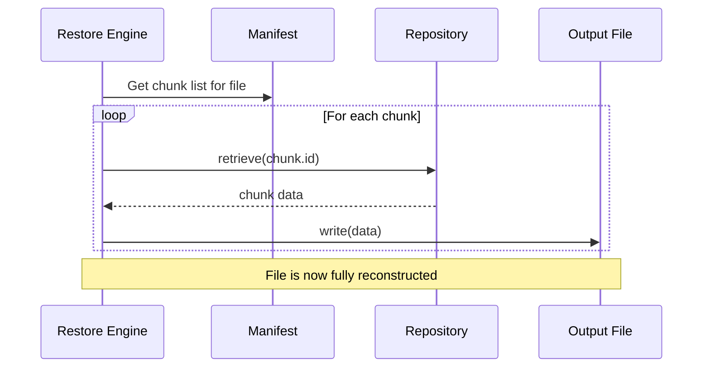
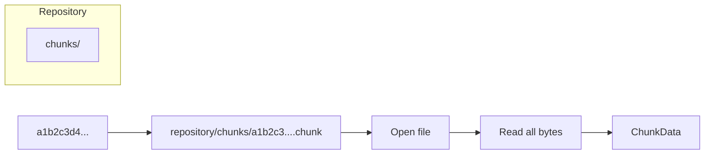

# Restore Process

## Overview

The restore process reconstructs the original directory structure and file contents from a backup manifest and stored chunks.



## Step by Step

### 1. Load Manifest

```cpp
auto load_result = manifest_->load(backup_id);
```

The manifest JSON is read and parsed into a `BackupManifest` struct containing all files and their chunk references.

### 2. Create Output Directories

For each file, the restore engine creates the parent directory relative to the output root:

```text
Output: /tmp/restore
File:   Documents/report.pdf
Create: /tmp/restore/Documents/
```

### 3. Reassemble Files

For each file, chunks are retrieved in order and written sequentially:



```cpp
for (const auto& chunk : fm.chunks) {
    auto chunk_result = repository_->retrieve(chunk.id);
    auto& data = chunk_result.value();
    out_file.write(reinterpret_cast<const char*>(data.data()),
                   static_cast<std::streamsize>(data.size()));
}
```

### 4. Error Handling

If a chunk is missing (corrupted or deleted repository), the file is skipped and an error is reported:

```text
Warning: Missing chunk a1b2c3... for Documents/report.pdf
```

The restore continues with remaining files.

## Chunk Retrieval



## Restore Engine

```cpp
class RestoreEngine {
public:
    explicit RestoreEngine(const Config& config);
    Result<void> run_restore(
        const std::string& backup_id,
        const std::filesystem::path& output_dir);
    Result<void> list_backups();
};
```

### Usage

```bash
backupcore restore backup_20260717_194136_876 /tmp/restored
```

### Output

```text
Restoring: backup_20260717_194136_876
Files: 42
  Restored: "Documents/report.pdf"
  Restored: "Documents/notes.txt"
  Restored: "Photos/vacation.jpg"
Restore complete.
  Files restored: 42/42
  Bytes restored: 15632384
```

## Verification

After restore, verify the files match the originals:

```bash
diff -r /original/source /tmp/restored
```

Or check individual files:

```bash
sha256sum /original/source/Documents/report.pdf
sha256sum /tmp/restored/Documents/report.pdf
```

## Limitations

- **No partial restore** — currently restores all files in a backup
- **No streaming** — everything goes through memory (fine for files up to available RAM)
- **No concurrent restore** — single-threaded (simplifies implementation)
