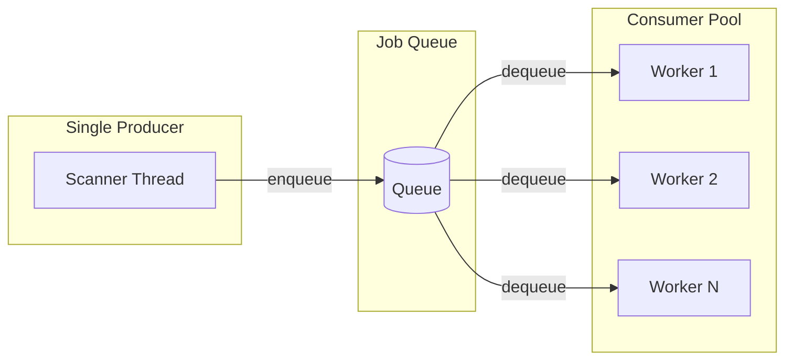
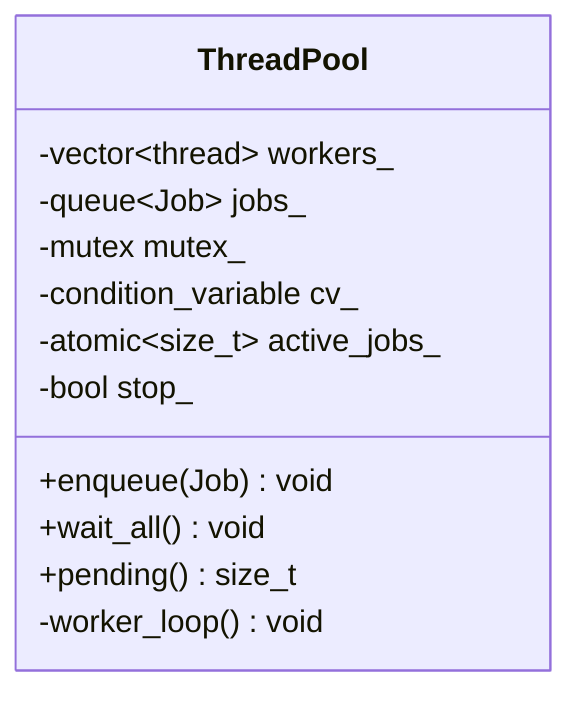
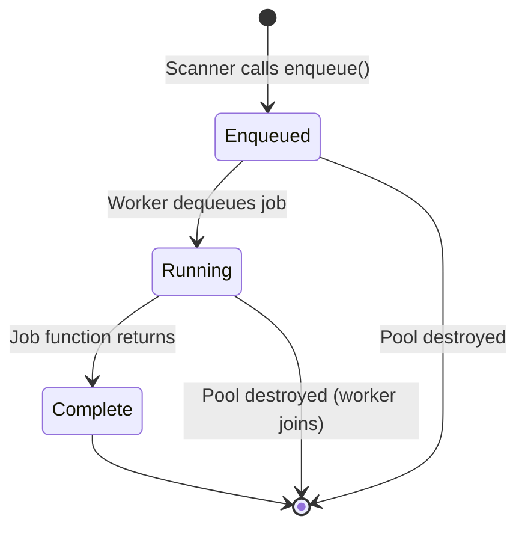
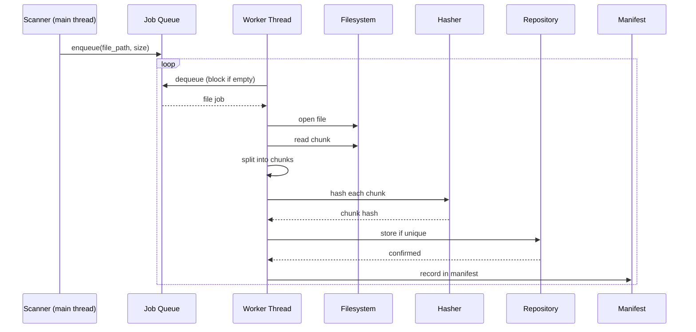

# Threading Model

## Overview

BackupCore uses a **producer-consumer** threading model. A single scanner thread produces jobs, and a configurable pool of worker threads consumes them.



## Why This Model?

The producer-consumer pattern is ideal for backup workloads because:

1. **Scanner is I/O bound** — walking directories is fast and sequential
2. **Workers are CPU/I/O bound** — reading, chunking, hashing, and writing chunks benefit from parallelism
3. **Queue decouples** — the scanner doesn't block on slow workers, and workers don't wait for the scanner
4. **Backpressure** — the queue naturally absorbs bursts of file discoveries

## Thread Pool Architecture



### Job Lifecycle



## Thread Safety

### Locking Strategy

| Data Structure | Protection | Why |
|---------------|------------|-----|
| Job queue | `std::mutex` + `std::condition_variable` | Classic producer-consumer |
| Repository chunk set | Separate `std::mutex` | Chunks are shared across all workers |
| Manifest file list | `std::mutex` | Multiple workers append to same manifest |

### Deadlock Prevention

- All mutexes are acquired one at a time (no nested locking)
- `ThreadPool` mutex protects only the queue and stop flag
- `Repository` mutex protects only the chunk set and byte counter
- The manifest mutex in `BackupEngine` protects only the file list append

### Race Conditions Handled

1. **Duplicate chunk storage**: Two workers may hash the same content simultaneously. The `Repository::store()` method checks for duplicates inside its mutex lock, so only the first write succeeds.

2. **Concurrent manifest writes**: Each worker appends to `current_manifest_.files` under a mutex lock. File-level granularity means contention is minimal.

3. **Shutdown ordering**: The `ThreadPool` destructor signals `stop_`, notifies all workers, and joins them. Workers check `stop_` after waking.

## Worker Thread Execution



## Configuration

The number of worker threads is set in `config.json`:

```json
{
    "worker_threads": 4
}
```

### Guidelines

- **1-2 threads**: Best for HDDs (limited I/O parallelism)
- **4-8 threads**: Good for SSDs
- **8-16 threads**: May help with many small files or NVMe storage
- **Too many threads**: Diminishing returns from context switching and lock contention

## Thread Pool Implementation

```cpp
// Core loop
void ThreadPool::worker_loop() {
    while (true) {
        std::optional<Job> job;
        {
            std::unique_lock<std::mutex> lock(mutex_);
            cv_.wait(lock, [this] {
                return stop_ || !jobs_.empty();
            });
            if (stop_ && jobs_.empty()) return;
            job = std::move(jobs_.front());
            jobs_.pop();
            active_jobs_++;
        }
        if (job) {
            (*job)();
            active_jobs_--;
            cv_.notify_all();
        }
    }
}
```

Key points:
- Workers block on `cv_.wait()` when the queue is empty
- `wait_all()` blocks until both the queue is empty AND all active jobs finish
- The destructor signals `stop_` and joins all threads
